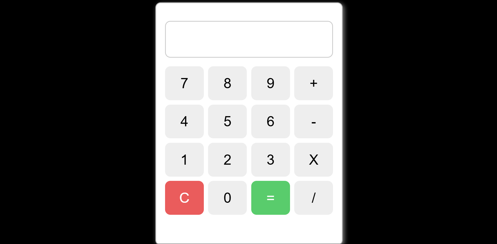

# Calculator

A simple, responsive calculator web application that performs basic arithmetic operations such as addition, subtraction, multiplication, and division. This project is designed to provide a functional and visually appealing calculator for everyday use, accessible from any device.

## Live Demo

Check out the live version of the calculator [here](https://sharafath07.github.io/Calculator/).

## Features

- **Basic Operations**: Addition, subtraction, multiplication, and division.
- **Responsive Design**: Works seamlessly across desktop, tablet, and mobile devices.
- **User-Friendly Interface**: Simple and intuitive design for ease of use.
- **Real-Time Calculations**: Updates results instantly as you input values and operations.

## Technologies Used

- **HTML5**: For structuring the web application.
- **CSS3**: For styling and creating a responsive design.
- **JavaScript**: For implementing the calculator's functionality and logic.

## How to Use

1. Visit the [Calculator website](https://sharafath07.github.io/Calculator/).
2. Input numbers using the numeric buttons.
3. Choose an operation (e.g., +, -, *, /).
4. Press "=" to see the result.
5. Use "C" to clear the current input or "CE" to reset the entire calculation.

## Screenshots



## Installation

If you want to run the calculator locally, follow these steps:

1. Clone the repository:
   ```bash
   git clone https://github.com/sharafath07/Calculator.git
   ```
2. Navigate to the project directory:
   ```bash
   cd Calculator
   ```
3. Open the `index.html` file in your browser:
   ```bash
   open index.html
   ```

## Future Enhancements

- Add advanced mathematical functions (e.g., square root, exponentiation, etc.).
- Include a dark mode option.
- Implement a history feature to track previous calculations.

## Contributing

Contributions are welcome! Feel free to submit issues or pull requests to improve this project.

## License

This project is licensed under the [MIT License](LICENSE).

## Contact

Created by [Sharafath](https://github.com/sharafath07) — feel free to reach out for feedback or collaboration!

